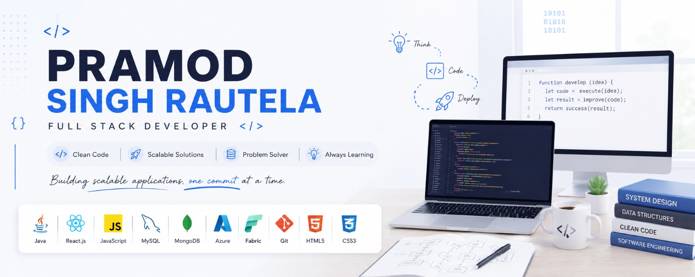

<p align="center">
  
</p>

# 👋 Hello, I'm Pramod Singh Rautela

### Full Stack Developer | Java Developer | Spring Boot Enthusiast

Building scalable backend systems, modern web applications, and cloud-ready solutions.

<p align="center">
  <a href="https://www.linkedin.com/in/prom101?utm_source=share_via&utm_content=profile&utm_medium=member_android">
    
  </a>
  <a href="mailto:pramodsrautelas@gmail.com">
    
  </a>
  <a href="https://github.com/PramodSinghRautela">
    
  </a>
</p>


</div>

---

# 💫 About Me

```java
public class Pramod {

    String role = "Full Stack Developer";

    String[] skills = {
        "Java",
        "Spring Boot",
        "React.js",
        "Microservices",
        "REST APIs",
        "MySQL",
        "MongoDB",
        "Azure",
        "AWS"
    };

    String currentCompany = "Tata Consultancy Services";

    String passion =
        "Building scalable applications and solving real-world problems";

}
```

🚀 Full Stack Developer with experience building enterprise-grade applications.

💻 Strong knowledge of Java, Spring Boot, React.js, REST APIs, SQL, MongoDB, and Cloud Technologies.

☁️ Interested in Backend Engineering, Microservices Architecture, Cloud Computing, and Software Design.

📈 Continuously learning and building production-ready applications.

---

# 🛠️ Tech Stack

## Programming Languages

<p align="left">

</p>

## Frontend Development

<p align="left">

</p>

## Backend Development

<p align="left">

</p>

## Databases

<p align="left">

</p>

## Cloud & DevOps

<p align="left">

</p>

## Tools & Technologies

<p align="left">

</p>

---

# 💼 Professional Experience

## Tata Consultancy Services (TCS)

### Full Stack Developer

📅 May 2025 - Present

✔ Developed and maintained application features using Java, Spring Boot, and MySQL.

✔ Built and enhanced REST APIs supporting business workflows.

✔ Developed frontend components using React.js.

✔ Optimized SQL queries and application performance.

✔ Participated in Agile development lifecycle.

✔ Worked on bug fixes, production support, and feature enhancements.

---

# 🚀 Featured Projects

## 🤖 AI-Powered Recruitment Portal

### Tech Stack

```text
React.js | Node.js | Express.js | MongoDB | OpenAI API
```

### Features

- AI Resume Screening
- Smart Candidate Ranking
- Recruiter Dashboard
- Candidate Management
- Admin Control Panel
- Secure Authentication
- Job Recommendation Engine

---

## 💰 Smart Finance Management System

### Tech Stack

```text
React.js | Java | Spring Boot | MySQL | Azure
```

### Features

- Expense Tracking
- Budget Management
- Financial Analytics
- Secure Authentication
- Role-Based Access Control
- Cloud Deployment Architecture

---

# 🏆 Certifications

🥇 Microsoft Fabric Data Engineer Associate (DP-700)

🥇 Microsoft Azure Data Fundamentals (DP-900)

🥇 Microsoft Azure AI Fundamentals (AI-900)

🥇 Cisco Data Analytics Essentials

---

# 📊 GitHub Statistics

<div align="center">


</div>

---

# 🔥 GitHub Streak

<div align="center">


</div>

---

# 📈 Contribution Graph

<div align="center">


</div>

---

# 🏅 GitHub Trophies

<div align="center">


</div>

---

# 🎯 Current Focus

```yaml
Backend Development:
  - Spring Boot
  - Microservices
  - REST APIs

Frontend Development:
  - React.js
  - Responsive UI

Cloud:
  - Azure
  - AWS

DevOps:
  - Docker
  - CI/CD

Learning:
  - System Design
  - Distributed Systems
```

---

# 🌟 Fun Fact

```text
while(alive){
    learn();
    build();
    improve();
    repeat();
}
```

---

<div align="center">

### ⭐ If you like my work, consider giving a star to my repositories.

### 💻 Building today for a better tomorrow.

</div>


