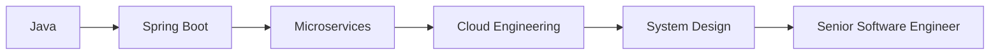

<p align="center">
  
</p>

<div align="center">


# Pramod Singh Rautela

**Full Stack Developer • Java • React.js • Microsoft Fabric**


</div>

---

# 🧑‍💻 Profile Snapshot

| Property | Value |
|-----------|---------|
| 👨 Name | Pramod Singh Rautela |
| 💼 Role | Full Stack Developer |
| 🏢 Company | Tata Consultancy Services |
| 📍 Location | Bangalore, India |
| 🎓 Education | B.Tech CSE |
| ☁️ Cloud | Azure + Fabric |
| ❤️ Interests | Full Stack, Cloud, Data Engineering |

---

# ⚡ Current Mission

```text
Level Up Backend Development
████████░░ 80%

Spring Boot
██████░░░░ 60%

Microservices
█████░░░░░ 50%

System Design
█████░░░░░ 50%

Cloud Engineering
███████░░░ 70%
```

---

# 🛠 Tech Arsenal

## Languages


## Frontend


## Backend


## Cloud & Tools


---

# 🏗 Featured Builds

## 🛒 Shop Sphere

```yaml
Type: Full Stack E-Commerce Platform

Features:
  - Product Catalog
  - Search & Filtering
  - Wishlist
  - Cart
  - Checkout

Tech:
  - React.js
  - Redux Toolkit
  - Java
  - MongoDB
  - REST APIs
```

### Impact

✔ 10+ API Integrations

✔ 15+ Shared Components

✔ 25% Faster Page Loads

---

## 🎓 Online Admission Portal

```yaml
Type: Education Management System

Features:
  - Student Registration
  - Application Tracking
  - Document Management
  - Workflow Automation

Tech:
  - Java
  - MySQL
```

### Impact

✔ 200+ Applicant Capacity

✔ 40% Manual Effort Reduction

✔ Optimized Database Performance

---

# 📈 GitHub Metrics

<div align="center">


</div>

---

# 🏆 Achievement Wall

🥇 DP-700 Fabric Data Engineer Associate

🥇 DP-900 Azure Data Fundamentals

🥇 AI-900 Azure AI Fundamentals

🥇 Cisco Cybersecurity Essentials

---

# 🎯 Roadmap



---

# ☕ Current Status

```java
public class Pramod {

    String focus = "Building Better Software";

    String currentGoal =
        "Become a Strong Full Stack Engineer";

    String nextTarget =
        "Spring Boot + Microservices + Cloud";
}
```

---

# 📫 Reach Me

📧 pramodsrautelas@gmail.com

💼 LinkedIn: linkedin.com/in/prom101

💻 GitHub: github.com/PramodSinghRautela

---

<div align="center">

### 🚀 One Commit Better Than Yesterday

</div>
